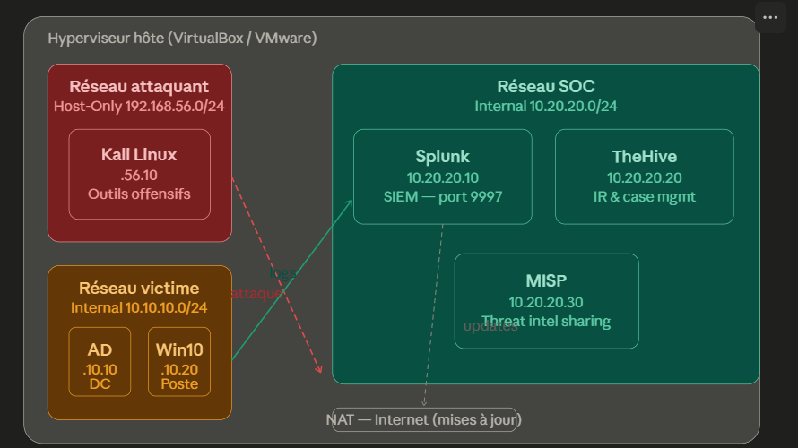

# 🛡️ Projet Home Lab : Simulation Attaque/Défense & SOC

## 📝 Présentation du projet
Ce projet consiste en la création d'un laboratoire de cybersécurité complet et virtualisé. L'objectif est de simuler un environnement d'entreprise réaliste pour pratiquer l'exploitation de vulnérabilités, la détection de menaces (SIEM) et la réponse aux incidents (Incident Response).

L'infrastructure permet de couvrir l'intégralité du cycle de vie d'une cyber-attaque, de la reconnaissance à l'exfiltration, tout en configurant les outils de défense utilisés en centre SOC.

---

## 🏗️ Architecture du Réseau
Voici le schéma de l'infrastructure déployée :

### 🔴 Zone Offensive (Réseau Attaquant)
* **Système :** Kali Linux
* **Rôle :** Tests d'intrusion, scans de vulnérabilités et exploitation.
* **Configuration :** Isolé en mode *Host-Only* (`192.168.56.0/24`).

### 🟡 Zone Cible (Réseau Victime)
* **Composants :** Active Directory (Domain Controller) & Poste client Windows 10.
* **Rôle :** Simulation d'un parc informatique d'entreprise.
* **Configuration :** Réseau interne (`10.10.10.0/24`).

### 🟢 Zone Défensive (Réseau SOC)
* **Splunk (SIEM) :** Centralisation et analyse des logs via le port `9997`.
* **TheHive :** Gestion des alertes et orchestration de la réponse aux incidents.
* **MISP :** Plateforme de Threat Intelligence pour l'enrichissement des données de menaces.
* **Configuration :** Réseau interne (`10.20.20.0/24`).

---

## 🛠️ Stack Technique
| Composant | Technologie | Utilisation |
| :--- | :--- | :--- |
| **Hyperviseur** | VirtualBox / VMware | Virtualisation de l'infrastructure |
| **SIEM** | Splunk Enterprise | Analyse de logs et Dashboarding |
| **Endpoint Monitoring** | Sysmon & Splunk Forwarder | Télémétrie avancée sur les cibles Windows |
| **Incident Management** | TheHive | Gestion de tickets et investigation |
| **Threat Intel** | MISP | Partage et corrélation d'IOCs |

---

## 🚀 Objectifs d'Apprentissage
1. **Offensif :** Exécuter des attaques (Brute force, Pivotement, Kerberoasting) sans impacter le réseau local physique.
2. **Défensif :** Configurer des règles d'alerte sur Splunk basées sur le framework MITRE ATT&CK.
3. **Réponse aux incidents :** Créer des "Playbooks" dans TheHive pour automatiser l'analyse des alertes.